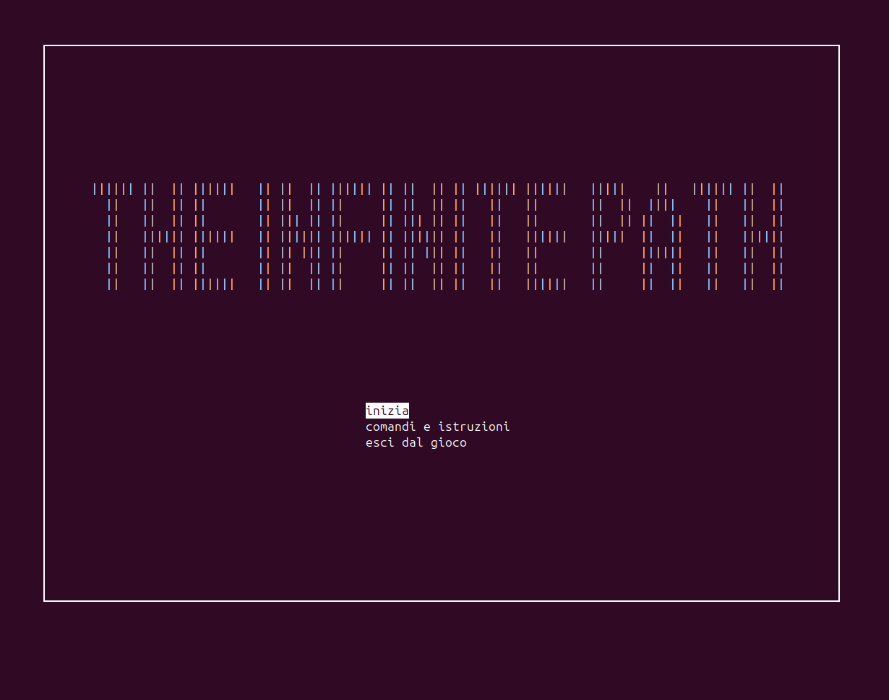
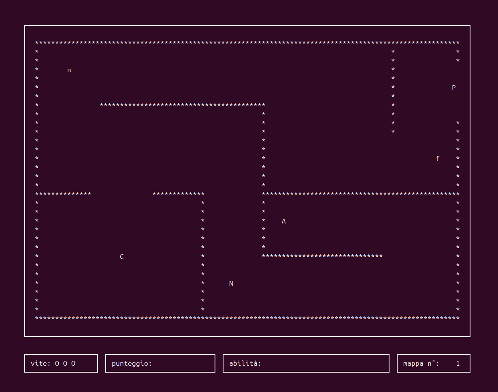

# InfinitePath

A dungeon roguelike game written in C++.

*Programming team project - University of Bologna (a.y. 2021-2022)*

*The game is in italian*

<div style="display: flex; justify-content: center; gap: 20px; flex-wrap: wrap;">
  
   
</div>

## Contributors

[Sofia Zanelli (@SofZll)](https://github.com/SofZll)  
[Kaori Jiang (@Kmoon-7)](https://github.com/Kmoon-7)

## Description

InfinitePath is a roguelike adventure game where the player must navigate various rooms, collect items, fight enemies, and survive as long as possible. The maps are infinitely randomized and it is possible to go back to the previous rooms and find the stuffs that were left behind.

The objective is to kill enemies and accumulate as much points as possible. The game ends when the character's health points reaches zero.

## Controls

| Action          | Key         |
|-----------------|-------------|
| Movement        | W, A, S, D  |
| Attack          | Arrow Keys  |
| Menu Navigation | ↑/↓ + Enter |

## Game Elements

### Objects
| Symbol | Item      | Effect                          |
|--------|-----------|---------------------------------|
|   C    | Key       | Unlocks doors to new rooms      |
|   A    | Artifact  | Random bonus (HP, speed, etc.)  |

### Enemies
| Symbol | Type       | Behavior                        |
|--------|------------|---------------------------------|
|   n    | Wanderer   | Moves randomly (-10 HP contact) |
|   N    | Chaser     | Pursues player (-10 HP contact) |
|   f    | Shooter    | Fires projectiles at player     |

## Installation

```bash
git clone <repository-url>
cd InfinitePath
make && ./output
```

### Clean compiled files
```bash
make clean
```
